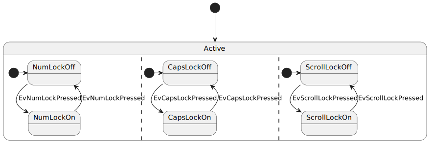
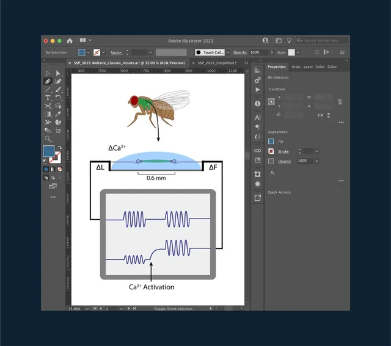

<!-- _class: lead -->

# Giving Talks on Research

## Whats and Hows

Jifeng Wu

*With inspiration from Derek Dreyer, Simon Peyton Jones, Finn Hacket, Robert Xiao*

October 27, 2023

------

<!-- header: Contents -->

- Whats👈
- Hows

------

<!-- header: Contents::Whats -->

- Whats
    - Goals👈
    - Perks

------

<!-- header: Contents::Whats::Goals -->

- Get people to read your paper?❌
- Give people positive feelings about you and your work!$^1$✅
- Entertain your audience!✅
    - "Your mission is to wake them up!" $^2$
    - "Your most potent weapon, by far, is your enthusiasm!" $^2$
    - "Put on a show!" $^3$

> 1: Derek Dreyer. How to write papers and give talks that people can follow. (The Cornell, Maryland, Max Planck Pre-doctoral Research School, 2023)
> 2: Simon Peyton Jones. How to give a great research talk. (MSR Summer School, 2016)
> 3: John Hughes. Unaccustomed as I am to public speaking. (PLMW, 2016)

------

During the talk:

- *Verbal*
    - Variation in your voice
    - Interesting puns
- *Nonverbal* $^1$
    - Eye contact
    - Gestures
    - Moving on the stage

> 1: Finn Hacket and Robert Xiao. Workshop on presentation skills.

------

On the conclusion slide:

- Conclusion sentence
- Acknowledgements
- Website and QR code for publicity

------

Q&A session:

- Acknowledge good questions.
- Disagreement:
    - Understand their viewpoint.
    - Acknowledge reasonable points.
    - Politely present personal opinion.
- Inability to answer:
	- *Be honest.*
    - Present relevant parts that we *do know*.
    - Anticipate *directions for future work*.

------

<!-- header: Contents::Whats -->

- Whats
    - Goals
    - Perks👈

------

<!-- header: Contents::Whats::Perks -->

------

- You can't say much.
- The audience may or may not care.
- The audience may easily get lost.
- You have to convey information visually.

> 1: Derek Dreyer. How to write papers and give talks that people can follow. (The Cornell, Maryland, Max Planck Pre-doctoral Research School, 2023)

------

# A ~~paper~~ talk structure that works$^1$

- ~~Abstract~~
- Introduction (8 minutes)
- Key ideas (11 minutes)
- ~~Technical details~~
- ~~Related work~~
- *Conclusion slide*

> 1: Derek Dreyer. How to write papers and give talks that people can follow. (The Cornell, Maryland, Max Planck Pre-doctoral Research School, 2023)

------

- Intro (8 minutes)
    - Stage the motivation!
        - General version of your problem (2 minutes)
        - Your specific problem (4 minutes)
    - Tell them what you did!
        - Contributions
        - Overview of the key ideas

> 1: Derek Dreyer. How to write papers and give talks that people can follow. (The Cornell, Maryland, Max Planck Pre-doctoral Research School, 2023)

------

Coherence $^1$:

- Be minimal. $^2$
- Make the focus obvious. $^2$

Flow $^1$:

- Be incremental. $^2$
- Introduce concepts when we need them. $^2$

> 1: Derek Dreyer. How to write papers and give talks that people can follow. (The Cornell, Maryland, Max Planck Pre-doctoral Research School, 2023)
> 2: Ranjit Jhala, "How to Design Talks".

------

<!-- header: Contents -->

- Whats
- Hows👈

------

<!-- header: Contents::Hows -->

- Hows
    - Tools👈
    - Note-taking
    - Practicing

------

<!-- header: Contents::Hows::Tools -->

- Slides👈
- Figures

------

<!-- header: Contents::Hows::Tools::Slides -->

# Tools with decreasing *expressiveness*

- Presentation programs
- Beamer
- Frameworks for designing presentations with *Markdown dialects*
    - Rmarkdown$^1$
    - Marp$^2$
    - Pandoc$^3$

> 1: https://rmarkdown.rstudio.com/
> 2: https://marp.app/
> 3: https://pandoc.org/

------

# Powerful $\ne$ Best for the job

------

# Aspects to consider

- *First-class support* for features including:
    - Animations
    - Block quotations
    - Code blocks
    - Math expressions
    - Citations
    - Interactive visualizations
- Integration with the rest of the research pipeline
- Collaboration

------

<!-- header: Contents::Hows::Tools -->

- Slides
- Figures👈

------

<!-- header: Contents::Hows::Tools::Figures -->

# Figures

*"Diagrams are pictorial, yet abstract, representations of information. Line graphs, bar charts, engineering blueprints, and architects' sketches are all examples of diagrams, whereas photos and video are not."* $^1$

- Diagrams👈
- Other Figures

> 1: Michael Anderson (1997). "Introduction to Diagrammatic Reasoning"

------

<!-- header: Contents::Hows::Tools::Diagrams -->

# Diagrams

- Quantitative Diagrams
    - *Please search "data visualization tools"*
- Qualitative Diagrams👈

------

<!-- header: Contents::Hows::Tools::Diagrams::Qualitative Diagrams -->

# Qualitative Diagrams

- Existing Models👈
- From Scratch

------

<!-- header: Contents::Hows::Tools::Diagrams::Qualitative Diagrams::Existing Models -->

# Mindmaps$^1$$^2$

> 1: https://mermaid.js.org/syntax/mindmap.html
> 2: https://plantuml.com/mindmap-diagram

------

# Class Diagrams$^1$$^2$

> 1: https://mermaid.js.org/syntax/classDiagram.html
> 2: https://plantuml.com/class-diagram

------

# Flowcharts$^1$ and Activity Diagrams$^2$

> 1: https://mermaid.js.org/syntax/flowchart.html
> 2: https://plantuml.com/activity-diagram-beta

------

# State Diagrams$^1$$^2$

> 1: https://mermaid.js.org/syntax/stateDiagram.html
> 2: https://plantuml.com/state-diagram

------

# Sequence Diagrams$^1$$^2$

> 1: https://mermaid.js.org/syntax/sequenceDiagram.html
> 2: https://plantuml.com/sequence-diagram

------

# Object Diagram$^1$

> 1: https://plantuml.com/object-diagram

------

# JSON$^1$

> 1: https://plantuml.com/json

------

# YAML$^1$

> 1: https://plantuml.com/yaml

------

# EBNF$^1$

> 1: https://plantuml.com/ebnf

------

<!-- header: Contents::Hows::Tools::Diagrams::Qualitative Diagrams -->

# Qualitative Diagrams

- Existing Models
- From Scratch👈

------

<!-- header: Contents::Hows::Tools::Diagrams::Qualitative Diagrams::From Scratch -->

Structured:

------

Unstructured: make sure to leverage existing *stock images*!

------

What if it is complicated, but there are patterns?

------

Scripting to the rescue!

------

- JavaScript scripting for Adobe Illustrator$^1$$^2$
- Python scripting for Inkscape$^3$
- Python scripting for GIMP$^4$

> 1: https://medium.com/@jtnimoy/illustrator-scripting-in-visual-studio-code-cdcf4b97365d
> 2: https://ai-scripting.docsforadobe.dev/
> 3: https://inkscape.org/~pakin/%E2%98%85simple-inkscape-scripting
> 4: https://medium.com/@chriziegler/introduction-to-python-scripting-in-gimp-141b860ad7e

------

<!-- header: Contents::Hows -->

- Hows
    - Tools
    - Note-taking👈
    - Practicing

------

<!-- header: Contents::Hows::Note-taking -->

Different people have different habits$^1$:

- Full written script?
- Talking points?
- No notes at all?

------

*Personal approach:*

1. Try to deliver the talk *impromptu* in front of the computer.
2. When feeling *stuck* or *awkward*, think about how to present the content, and write notes.

------

<!-- header: Contents::Hows -->

- Hows
    - Tools
    - Note-taking
    - Practicing👈

------

<!-- header: Contents::Hows::Practicing -->

# With whom?

- Yourself
- Your supervisor
- Other people from your lab
- People from other labs
    - *Ignorance is a plus.*$^1$

------

<!-- header: Conclusions -->

We can all give great talks!

Follow my personal website at abbaswu.github.io!

